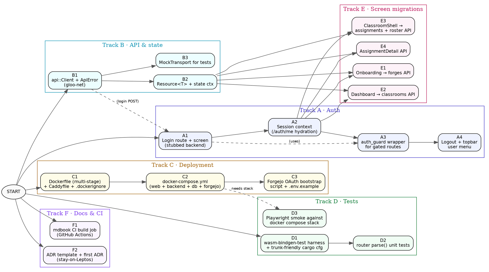

# Parallel task map

This page is the **single source of truth** for who-can-work-on-what right
now. Each node is a self-contained task that an agent (or human) can pick
up. Edges are *hard* dependencies — if A → B, B is blocked until A is
merged. Anything not connected by an edge can run in parallel.

Detailed task cards (acceptance criteria, file paths, exact commands) live
in [agent task cards](./agents.md). This page is the dependency graph.

## Tracks at a glance

| Track | Theme                       | Can start now? |
| ----- | --------------------------- | -------------- |
| **A** | Auth & session plumbing     | yes            |
| **B** | API client + state refactor | yes            |
| **C** | Docker + compose            | yes            |
| **D** | Test infrastructure         | yes            |
| **E** | Screen migrations to API    | after A1 + B1  |
| **F** | mdbook CI & polish          | yes            |

Tracks A, B, C, D, F have **no inter-track dependencies** at their starting
nodes — four agents can begin simultaneously. Track E gates on the
foundation pieces (`A1`, `B1`).

## Dependency graph (Graphviz DOT)

Render with `dot -Tsvg book/src/roadmap/graph.dot -o graph.svg` once
`graph.dot` is extracted, or paste this block into any DOT viewer.



The DOT source is also available standalone at
[`book/src/roadmap/graph.dot`](./graph.dot) so it can be rendered into the
book or PRs without copy-paste.

## Parallel start plan (six agents, day one)

Spawn one agent per node below — they only touch disjoint files:

| Agent | Task | Files touched (exclusive)                      |
| ----- | ---- | ---------------------------------------------- |
| α     | A1   | `src/screens/login.rs`, `src/router.rs` (add variants), `src/app.rs` (route arm) |
| β     | B1   | `src/api/`, `Cargo.toml` (gloo-net dep)        |
| γ     | C1   | `Dockerfile`, `deploy/Caddyfile`, `.dockerignore` |
| δ     | D1 ✅ | `tests/`, `Cargo.toml` (dev-deps), `.cargo/config.toml` |
| ε     | F1   | `.github/workflows/book.yml`                   |
| ζ     | F2   | `book/src/adr/0001-stay-on-leptos.md`, `book/src/SUMMARY.md` |

`src/router.rs` and `src/app.rs` are touched only by α. Other agents must
not edit those files in their first PR; if they need a route, they ask α
to add it (cheap PR).

## Wave 2 (after wave-1 PRs land)

- **A2** unblocked by A1.
- **B2** unblocked by B1.
- **B3** unblocked by B1 (parallel to B2).
- **C2** unblocked by C1.
- **D2** unblocked by D1 ✅ (harness landed — `tests/smoke.rs` passes
  `cargo build --target wasm32-unknown-unknown --test smoke`).

## Wave 3

- **A3, A4** in serial after A2.
- **C3** after C2.
- **E1–E4** can all run in parallel once A2 + B2 are merged. Each touches
  exactly one screen file, so four agents can run concurrently.
- **D3** after C2.

## Test gate per task

Every task card in [agents.md](./agents.md) ends with a **Test gate**: the
exact command(s) that must pass before the PR is mergeable. The gate is
the contract — if it passes, the task is done; if it fails, the task is
not.

Cross-cutting CI on every PR (set up by F1):

```bash
cargo fmt --all -- --check
cargo clippy --target wasm32-unknown-unknown --all-targets -- -D warnings
cargo check --target wasm32-unknown-unknown
trunk build --release
mdbook build
```

Tracks D1 and onwards add `wasm-pack test --headless --firefox` and (D3)
`npx playwright test` to the pipeline.
